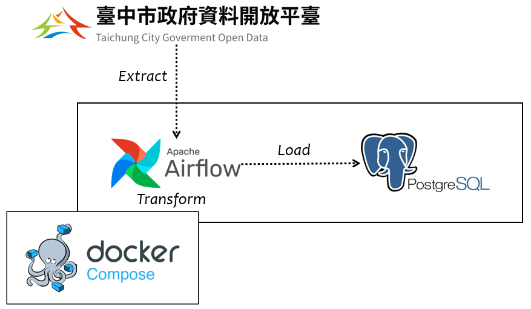
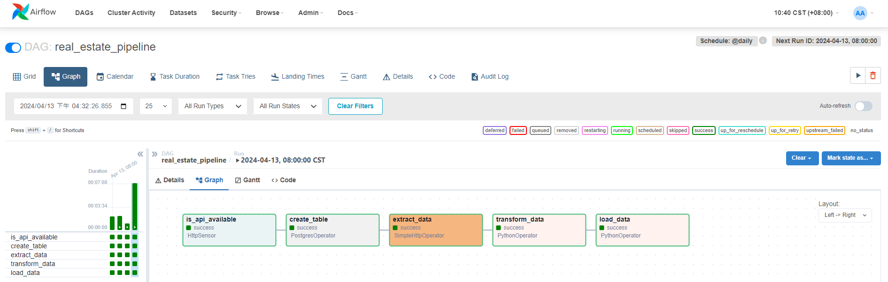
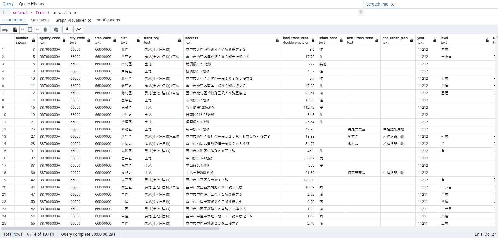

# ETL Project: real estate transaction

### Architecture



### Description

Use Airflow to establish an ETL pipeline.

Data source: [Taichung actual price registration of real estate transaction in 2023](https://datacenter.taichung.gov.tw/swagger/OpenData/117b24e0-4a33-4bab-9160-b9e6c1e92dcb).

### ETL flow

1. Extract raw data from Taichung opendata.
2. Transform raw data
   - Remove special transaction data to avoid influencing information interpretation.
   - Add a new column to group the house ages every 10 years for easier data visualization in the future.
3. Load processed data to database (PostgreSQL)

### How to use

```$ docker compose up -d```

It requires to set up airflow connections for the data source and database.

Just run ```./airflow_conn_init.sh``` in any airflow docker container.

### Screenshot

1. DAG view


2. Data loaded to database

